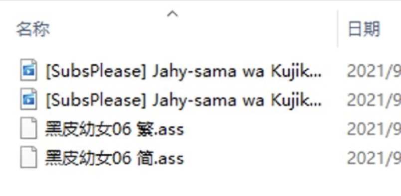
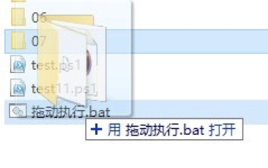

# 一键压制脚本使用介绍

### 压制环境

##### 软件安装

- python

  > 版本3.9.7，点击[此处](https://www.python.org/ftp/python/3.9.7/python-3.9.7-amd64.exe)下载

- vapoursynth

  > 版本R55，点击[此处](https://github.com/vapoursynth/vapoursynth/releases/download/R55/VapourSynth64-R55.exe)下载

- vapoursynth滤镜

  > 将滤镜包内的dll文件放在vapour synth目录下的core/plugins

- ffmpeg

  > 版本4.4，点击[此处](https://www.gyan.dev/ffmpeg/builds/ffmpeg-release-full.7z)下载
  >
  > 需要将ffmpeg.exe添加到系统环境变量，请自行百度

### 使用方法

1. 将视频文件和字幕文件存放在同一个文件夹里，如图例:

​    

2. 将脚本文件ps1和bat放在同一个文件夹里(随便哪里都可以)
3. 将放有视频和字幕文件的文件夹拖动到bat文件上，就会开始自动压制，如图例:



### 脚本功能

1. 自动化1080分辨率视频压制(其他分辨率需要自行修改)

2. 自动识别文件名和集数

   > 通过源文件名 [raw] filename - 01 的样式进行匹配

3. 可以自行更改文件名输出，修改ps1文件的11，12行

   ```powershell
   $fullname_sc=-join("[Comicat&KissSub][",$name,"][",$eposide,"][1080P][GB][MP4].mp4")
   ```

4. 可以自行更改压制参数，修改ps1文件的32，41行

   ```powershell
   cmd /c "vspipe --y4m encode.vpy - |ffmpeg -i pipe: -i bgm.mka -c:v libx264 -preset slow -crf 23 -c:a copy encode.mp4"
   ```
   
5. 可以自行设定vapoursynth压制脚本，修改ps1文件的第15-20行

   ```powershell
   @'
   from vapoursynth import core
   import sys 
   source = r"video.mkv"
   video  = core.lsmas.LWLibavSource(source,format="yuv420p8",fpsnum=24000,fpsden=1001)
   video  = core.xyvsf.TextSub(video,r"sub.ass")
   video.set_output()
   '@ > .\encode.vpy
   ```

___

> 脚本 by 11
>
> 感谢 田姆斯邦德 帮忙测试


有任何问题可以直接私信联系我
